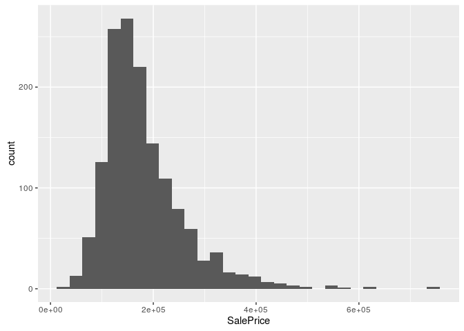
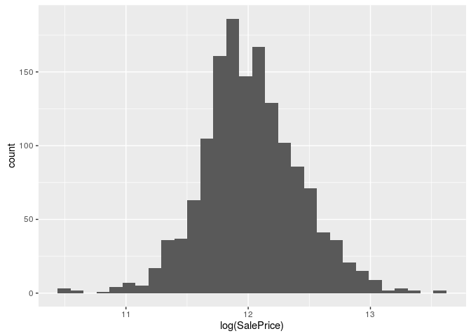

Advanced Regression Techniques for House Pricing
================
Anthony A. Boyles
September 19, 2016

-   [Assemble the Data!](#assemble-the-data)
-   [Clean the Data!](#clean-the-data)
    -   [Bad Names](#bad-names)
    -   [Missing Values](#missing-values)
    -   [Outcome Transformation](#outcome-transformation)
    -   [The Rare Factors Problem](#the-rare-factors-problem)
    -   [Write the Data!](#write-the-data)
-   [Model the Data!](#model-the-data)
    -   [Linear Model](#linear-model)
    -   [ElasticNet](#elasticnet)
    -   [Cubist](#cubist)
    -   [Random Forest](#random-forest)
    -   [SVM](#svm)
    -   [XGBoost](#xgboost)
    -   [Crunch](#crunch)
    -   [Make Some Predictions!](#make-some-predictions)

Note: while I haven't actually used any code from it, I owe a debt of gratitude to Stephanie Kirmer for [this Kernel](https://www.kaggle.com/skirmer/house-prices-advanced-regression-techniques/fun-with-real-estate-data), which was useful in guiding me through my own early data management and modeling.

``` r
library("readr")
library("dplyr")
library("ggplot2")
library("MASS")
library("glmnet")
library("glmnetUtils")
library("Cubist")
library("randomForest")
library("e1071")
library("xgboost")
library("ShRoud")
```

Assemble the Data!
==================

``` r
rawtrain <- read_csv("rawdata/train.csv")
rawtest  <- read_csv("rawdata/test.csv")
```

That was uneventful.

Clean the Data!
===============

Bad Names
---------

First things first! Some of these columns have names that start with numerals. That makes R ...itchy. Let's just fix that right quick:

``` r
training <- rawtrain %>%
  dplyr::rename(
    FirstFlrSF  = `1stFlrSF`,
    SecondFlrSF = `2ndFlrSF`,
    ThreeSsnPorch = `3SsnPorch`
  )
```

Missing Values
--------------

There are a ton of them. They make the models fail. In a perfect world, we would analyze each column for its missingness and do multiple imputation to fill in the values we could reasonably impute, but I don't have the time or the patience for that. Instead, I'm just going to replace all missing values with the arithmetic mean of values in the that column for numeric columns, and "Unknown" for character columns.

``` r
training <- fixNAs(training)
```

Outcome Transformation
----------------------

If we take a look at the distribution of our outcome metric...

``` r
training %>%
  ggplot(aes(SalePrice)) +
  geom_histogram()
```

    ## `stat_bin()` using `bins = 30`. Pick better value with `binwidth`.



You'll note that these values vary over several orders of magnitude (as [Alexandru Papieu pointed out](https://www.kaggle.com/apapiu/house-prices-advanced-regression-techniques/regularized-linear-models)), so it may make more sense to predict the log-transformation of the data.

``` r
training %>%
  ggplot(aes(log(SalePrice))) +
  geom_histogram()
```

    ## `stat_bin()` using `bins = 30`. Pick better value with `binwidth`.



It certainly apprears to be closer to normally-distributed (which is helpful). OK, so to do this transformation, let's measure the skewness of each variable, and log-transform those with a high skewness.

``` r
skewnessThreshold <- 3

transformedColumns <- c()

for(column in (colnames(training) %\% c("Id"))){
  if(is.numeric(training[[column]])){
    if(skewness(training[[column]]) > skewnessThreshold){
      training[[column]] <- log1p(training[[column]])
      transformedColumns <- c(transformedColumns, column)
    }
  }
}
```

The Rare Factors Problem
------------------------

The biggest problem I encountered in early modeling efforts was rare factors. Basically, what happens is we partition the data for cross-validation and there's a factor with one especially rare value. All instances of that rare value land in the test data, so we have no way to assign a coefficient to it, and the model fails.

The simplest way to handle this is to drop any categorical variable with a value that is rarer than some tolerance threshold for model failure (basically, how patient you are). That's what I did for my first pass:

``` r
# Note that this code is not run:
training <- training %>% dplyr::select(-c(MSZoning, Street, Alley, LotShape, Utilities, LandSlope, Neighborhood, Condition1, Condition2, HouseStyle, RoofStyle, RoofMatl, Exterior1st, Exterior2nd, MasVnrType, ExterQual, ExterCond, Foundation, BsmtCond, BsmtFinType2, Heating, HeatingQC, Electrical, Functional, GarageType, GarageQual, GarageCond, PoolQC, Fence, MiscFeature, SaleType, SaleCondition, LotConfig))
```

A better way to solve this problem is to translate ordinal variables onto a continuous scale. A computer can't figure out how far "good" is from "poor," but it can definitely figure out the difference between 4 and 1. That works adequately for ordinal variables, but its throwing away some discernable signal, and it works less well for nominal variables. For example, there is no inherent ordinality in countertop materials, but the market values granite more highly than formica. This is particularly instructive: instead of assuming that an ordinal variable follows its order, let's actually take the mean price for each category and see whether it follows the implied ordering.

So, let's take a category we'd otherwise throw away, and figure out how to numberify it.

``` r
table(training$ExterCond)
```

    ## 
    ##   Ex   Fa   Gd   Po   TA 
    ##    3   28  146    1 1282

Perfect. With a 70-30 training-test partitioning, the probability that Po ("Poor") has no representatives in the training data is .3, which is totally unworkable. (The generalized formula for that metric, by the way, is *P*(Model Failure)=(1 − Training Proportion)<sup>size\\ of\\ smallest\\ category</sup>.) To fix it, let's look at the mean house price for each member of the class:

``` r
training %>%
  group_by(ExterCond) %>%
  summarise(AveragePrice = mean(SalePrice))
```

    ## # A tibble: 5 × 2
    ##   ExterCond AveragePrice
    ##       <chr>        <dbl>
    ## 1        Ex     201333.3
    ## 2        Fa     102595.1
    ## 3        Gd     168897.6
    ## 4        Po      76500.0
    ## 5        TA     184034.9

Here we can see that houses in Typical/Average shape on their exteriors actually fetch a slightly higher price, on average, than houses rated as being in "Good" shape. Cool! So, for every categorical variable that has a sufficiently high probability of causing a modeling failure, let's replace the categories with their average SalePrice.

``` r
failureThreshold <- 1e-6

transformedCategories <- list()

for(column in colnames(training)){
  if(is.character(training[[column]])){
    if(.3^(min(table(training[[column]]))-1) > failureThreshold){
      # This is not a sane way to do this, but I don't know any better way.
      temp <- eval(parse(text = paste0("group_by(training, ", column, ")"))) %>%
        summarise(AveragePrice = mean(SalePrice))
      replacements <- as.list(temp$AveragePrice)
      names(replacements) <- temp[[column]]
      training <- eval(parse(text = paste0("mutate(training, ", column," = as.numeric(replacements[", column,"]))")))
      transformedCategories[[column]] <- replacements
    }
  }
}
```

Write the Data!
---------------

Training is all set to go!

``` r
write_csv(training, "deriveddata/training.csv")
```

Now we need to give test the same treatment...

``` r
test <- rawtest %>%
  dplyr::rename(
    FirstFlrSF  = `1stFlrSF`,
    SecondFlrSF = `2ndFlrSF`,
    ThreeSsnPorch = `3SsnPorch`
  ) %>%
  fixNAs()

for(column in transformedColumns %\% "SalePrice"){
  test[[column]] <- log1p(test[[column]])
}

for(column in names(transformedCategories)){
  replacements <- transformedCategories[[column]]
  test <- eval(parse(text = paste0("mutate(test, ", column, " = replacements[test$", column, "][[1]])")))
}

write_csv(test, "deriveddata/test.csv")
```

And, we're done! On to...

Model the Data!
===============

Now, to make a preliminary preparation, let's partition the data into training and test sets so we can do some of our own scoring without having to submit new entries to Kaggle all the time.

``` r
temp <- training %>% mutate(train = runif(n()) < .7)
train <- temp %>% filter( train) %>% dplyr::select(-train)
test  <- temp %>% filter(!train) %>% dplyr::select(-train)
```

Linear Model
------------

``` r
modelLM <- lm(SalePrice ~ ., data=train)
summary(modelLM)
```

    ## 
    ## Call:
    ## lm(formula = SalePrice ~ ., data = train)
    ## 
    ## Residuals:
    ##     Min      1Q  Median      3Q     Max 
    ## -224994  -12582     401   11738  173883 
    ## 
    ## Coefficients: (2 not defined because of singularities)
    ##                       Estimate Std. Error t value Pr(>|t|)    
    ## (Intercept)          9.334e+05  1.428e+06   0.654 0.513527    
    ## Id                  -1.734e+00  2.178e+00  -0.796 0.426051    
    ## MSSubClass          -2.088e+02  6.665e+01  -3.132 0.001794 ** 
    ## MSZoning             4.043e-02  4.740e-02   0.853 0.393849    
    ## LotFrontage         -1.696e+02  5.649e+01  -3.002 0.002760 ** 
    ## LotArea              9.723e+03  3.534e+03   2.752 0.006054 ** 
    ## Street               4.704e-01  3.151e-01   1.493 0.135899    
    ## AlleyPave            4.165e+03  7.373e+03   0.565 0.572313    
    ## AlleyUnknown         4.069e+03  5.240e+03   0.777 0.437622    
    ## LotShape            -3.687e-02  4.853e-02  -0.760 0.447564    
    ## LandContourHLS       1.598e+04  6.634e+03   2.408 0.016225 *  
    ## LandContourLow       7.569e+02  8.686e+03   0.087 0.930576    
    ## LandContourLvl       9.594e+03  4.635e+03   2.070 0.038756 *  
    ## Utilities            1.958e+00  6.763e-01   2.895 0.003886 ** 
    ## LotConfig            1.630e-01  8.669e-02   1.880 0.060454 .  
    ## LandSlopeMod         7.920e+03  5.566e+03   1.423 0.155143    
    ## LandSlopeSev         2.832e+02  1.234e+04   0.023 0.981697    
    ## Neighborhood         2.863e-01  2.678e-02  10.689  < 2e-16 ***
    ## Condition1           2.647e-01  6.712e-02   3.944 8.67e-05 ***
    ## Condition2          -4.391e-02  1.141e-01  -0.385 0.700436    
    ## BldgType2fmCon       1.493e+04  1.201e+04   1.243 0.214212    
    ## BldgTypeDuplex       4.512e+03  8.794e+03   0.513 0.608007    
    ## BldgTypeTwnhs        9.563e+03  1.012e+04   0.945 0.345003    
    ## BldgTypeTwnhsE       4.859e+03  7.856e+03   0.619 0.536380    
    ## HouseStyle          -1.137e-01  5.348e-02  -2.127 0.033737 *  
    ## OverallQual          7.695e+03  1.320e+03   5.830 7.77e-09 ***
    ## OverallCond          5.287e+03  1.161e+03   4.556 5.96e-06 ***
    ## YearBuilt            3.872e+01  9.080e+01   0.426 0.669878    
    ## YearRemodAdd         6.198e+01  7.746e+01   0.800 0.423883    
    ## RoofStyle            3.322e-02  5.441e-02   0.611 0.541596    
    ## RoofMatl             3.441e-01  6.172e-02   5.575 3.29e-08 ***
    ## Exterior1st          1.368e-01  6.912e-02   1.980 0.048041 *  
    ## Exterior2nd         -7.532e-02  7.083e-02  -1.063 0.287882    
    ## MasVnrType          -8.258e-03  3.808e-02  -0.217 0.828365    
    ## MasVnrArea           2.621e+01  6.931e+00   3.781 0.000167 ***
    ## ExterQualFa         -9.252e+03  1.578e+04  -0.586 0.557860    
    ## ExterQualGd         -2.131e+04  6.447e+03  -3.306 0.000986 ***
    ## ExterQualTA         -2.645e+04  7.199e+03  -3.674 0.000253 ***
    ## ExterCond           -1.711e-02  8.176e-02  -0.209 0.834304    
    ## Foundation           4.072e-02  3.772e-02   1.079 0.280666    
    ## BsmtQualFa          -1.315e+04  8.589e+03  -1.531 0.126148    
    ## BsmtQualGd          -1.805e+04  4.601e+03  -3.924 9.39e-05 ***
    ## BsmtQualTA          -1.443e+04  5.646e+03  -2.556 0.010770 *  
    ## BsmtQualUnknown     -5.194e+03  4.727e+04  -0.110 0.912535    
    ## BsmtCond             2.863e-02  8.054e-02   0.355 0.722306    
    ## BsmtExposureGd       2.158e+04  4.099e+03   5.265 1.76e-07 ***
    ## BsmtExposureMn      -1.442e+03  4.206e+03  -0.343 0.731736    
    ## BsmtExposureNo      -6.811e+03  2.930e+03  -2.325 0.020299 *  
    ## BsmtExposureUnknown -2.025e+04  2.765e+04  -0.732 0.464122    
    ## BsmtFinType1BLQ      1.502e+03  3.807e+03   0.395 0.693248    
    ## BsmtFinType1GLQ      2.810e+03  3.427e+03   0.820 0.412492    
    ## BsmtFinType1LwQ     -6.993e+03  5.066e+03  -1.380 0.167836    
    ## BsmtFinType1Rec     -4.156e+02  4.179e+03  -0.099 0.920798    
    ## BsmtFinType1Unf     -8.775e+03  3.970e+03  -2.211 0.027321 *  
    ## BsmtFinType1Unknown         NA         NA      NA       NA    
    ## BsmtFinSF1          -1.178e+01  2.264e+01  -0.520 0.602919    
    ## BsmtFinType2BLQ     -5.245e+03  1.005e+04  -0.522 0.601877    
    ## BsmtFinType2GLQ      8.679e+03  1.164e+04   0.746 0.456062    
    ## BsmtFinType2LwQ      2.466e+03  9.843e+03   0.250 0.802273    
    ## BsmtFinType2Rec      1.710e+03  9.463e+03   0.181 0.856676    
    ## BsmtFinType2Unf      4.466e+03  3.526e+04   0.127 0.899248    
    ## BsmtFinType2Unknown         NA         NA      NA       NA    
    ## BsmtFinSF2          -4.286e+02  7.455e+03  -0.057 0.954166    
    ## BsmtUnfSF           -7.970e+00  2.280e+01  -0.350 0.726745    
    ## TotalBsmtSF          6.738e+00  2.309e+01   0.292 0.770498    
    ## Heating              9.072e-02  1.130e-01   0.803 0.422156    
    ## HeatingQC            7.420e-04  3.476e-02   0.021 0.982971    
    ## CentralAirY          4.898e+03  5.136e+03   0.954 0.340581    
    ## Electrical          -1.137e-01  5.528e-02  -2.058 0.039926 *  
    ## FirstFlrSF          -3.746e+01  5.367e+01  -0.698 0.485388    
    ## SecondFlrSF         -3.187e+01  5.353e+01  -0.595 0.551777    
    ## LowQualFinSF        -4.446e+03  3.454e+03  -1.287 0.198367    
    ## GrLivArea            7.978e+01  5.371e+01   1.485 0.137832    
    ## BsmtFullBath         6.606e+03  2.674e+03   2.471 0.013666 *  
    ## BsmtHalfBath        -3.858e+03  6.080e+03  -0.635 0.525907    
    ## FullBath             6.398e+03  2.916e+03   2.194 0.028497 *  
    ## HalfBath             1.737e+03  2.861e+03   0.607 0.543984    
    ## BedroomAbvGr        -2.185e+03  1.851e+03  -1.180 0.238168    
    ## KitchenAbvGr        -3.225e+04  1.730e+04  -1.865 0.062559 .  
    ## KitchenQualFa       -2.347e+04  8.100e+03  -2.898 0.003852 ** 
    ## KitchenQualGd       -2.463e+04  4.681e+03  -5.261 1.80e-07 ***
    ## KitchenQualTA       -2.719e+04  5.271e+03  -5.159 3.07e-07 ***
    ## TotRmsAbvGrd         1.823e+03  1.303e+03   1.399 0.162277    
    ## Functional           2.846e-01  9.259e-02   3.074 0.002179 ** 
    ## Fireplaces           5.288e+03  3.676e+03   1.439 0.150638    
    ## FireplaceQuFa       -5.157e+03  1.026e+04  -0.502 0.615505    
    ## FireplaceQuGd       -1.290e+04  7.695e+03  -1.677 0.093914 .  
    ## FireplaceQuPo       -1.208e+04  1.252e+04  -0.965 0.334918    
    ## FireplaceQuTA       -1.321e+04  7.968e+03  -1.657 0.097818 .  
    ## FireplaceQuUnknown  -9.413e+03  9.169e+03  -1.027 0.304895    
    ## GarageType          -1.505e-02  3.797e-02  -0.396 0.691835    
    ## GarageYrBlt         -1.101e+02  8.287e+01  -1.328 0.184403    
    ## GarageFinishRFn      8.155e+01  2.670e+03   0.031 0.975640    
    ## GarageFinishUnf      1.439e+02  3.340e+03   0.043 0.965651    
    ## GarageFinishUnknown  2.733e+04  1.061e+04   2.576 0.010149 *  
    ## GarageCars           1.292e+04  2.931e+03   4.410 1.16e-05 ***
    ## GarageArea          -3.095e+00  1.028e+01  -0.301 0.763486    
    ## GarageQual           1.686e-01  9.884e-02   1.706 0.088381 .  
    ## GarageCond          -1.137e-02  1.013e-01  -0.112 0.910701    
    ## PavedDriveP          8.332e+01  7.914e+03   0.011 0.991602    
    ## PavedDriveY          4.851e+03  4.707e+03   1.030 0.303059    
    ## WoodDeckSF           2.033e+01  8.427e+00   2.412 0.016065 *  
    ## OpenPorchSF          2.418e+01  1.522e+01   1.589 0.112376    
    ## EnclosedPorch        1.657e+02  6.340e+02   0.261 0.793886    
    ## ThreeSsnPorch        3.887e+02  1.339e+03   0.290 0.771652    
    ## ScreenPorch          1.934e+03  6.848e+02   2.825 0.004839 ** 
    ## PoolArea            -1.399e+04  3.019e+03  -4.634 4.12e-06 ***
    ## PoolQC               3.144e-01  1.259e-01   2.497 0.012700 *  
    ## Fence               -2.182e-02  6.750e-02  -0.323 0.746614    
    ## MiscFeature          3.412e-01  2.971e-01   1.149 0.251022    
    ## MiscVal              1.912e+03  1.481e+03   1.291 0.197184    
    ## MoSold              -3.693e+02  3.383e+02  -1.092 0.275267    
    ## YrSold              -8.793e+02  6.963e+02  -1.263 0.206993    
    ## SaleType            -1.850e-02  8.983e-02  -0.206 0.836878    
    ## SaleCondition        2.227e-01  8.871e-02   2.510 0.012244 *  
    ## ---
    ## Signif. codes:  0 '***' 0.001 '**' 0.01 '*' 0.05 '.' 0.1 ' ' 1
    ## 
    ## Residual standard error: 27130 on 880 degrees of freedom
    ## Multiple R-squared:  0.8969, Adjusted R-squared:  0.8838 
    ## F-statistic: 68.37 on 112 and 880 DF,  p-value: < 2.2e-16

Lots of useless stuff, some useful stuff, and a nice R^2. Not bad for a first stab, but how well does it actually score?

``` r
predictionLM <- predict(modelLM, test, type="response")
```

    ## Warning in predict.lm(modelLM, test, type = "response"): prediction from a
    ## rank-deficient fit may be misleading

``` r
rmse(log(test$SalePrice), log(predictionLM))
```

    ## [1] 0.1646906

OK, so that's our first quality benchmark.

ElasticNet
----------

I thought about doing Ridge Regression or LASSO, but why do either when you can do both at once?

``` r
#modelEN <- glmnet(SalePrice ~ ., data=train)
#predictionEN <- as.data.frame(predict(modelEN, test, type="response"))$s84
#rmse(log(test$SalePrice), log(predictionEN))
```

Cubist
------

``` r
modelCubist <- cubist(x = dplyr::select(train, -SalePrice), y = train$SalePrice, committees = 50)
predictionCubist <- predict(modelCubist, test)
rmse(log(test$SalePrice), log(predictionCubist))
```

    ## [1] 0.1177521

Random Forest
-------------

``` r
modelRF <- randomForest(SalePrice ~ ., data=factorize(train))
predictionRF <- predict(modelRF, factorize(test), type="response")
rmse(log(test$SalePrice), log(predictionRF))
```

    ## [1] 0.1311525

SVM
---

``` r
modelSVM <- svm(SalePrice ~ ., data=train)
predictionSVM <- predict(modelSVM, test, type="response")
rmse(log(test$SalePrice), log(predictionSVM))
```

    ## [1] 0.1557117

XGBoost
-------

``` r
# TODO...
```

Crunch
------

``` r
prediction <- (predictionLM + predictionCubist + predictionRF + predictionSVM) / 4
rmse(log(test$SalePrice), log(prediction))
```

    ## [1] 0.1165801

[Nice!](https://www.kaggle.com/c/house-prices-advanced-regression-techniques/leaderboard)

Make Some Predictions!
----------------------

Let's rerun it on the entire Kaggle training set, predict on the test set, write and submit it.

``` r
#modelCubist <- cubist(x = dplyr::select(rawtrain, -SalePrice), y = rawtrain$SalePrice, committees = 50)
#predictionCubist <- predict(modelCubist, rawtest)

#cbind(rawtest, predictionCubist) %>%
#  dplyr::transmute(Id, SalePrice = predictionCubist) %>%
#  write_csv("predictions/predictionCubist.csv")
```
