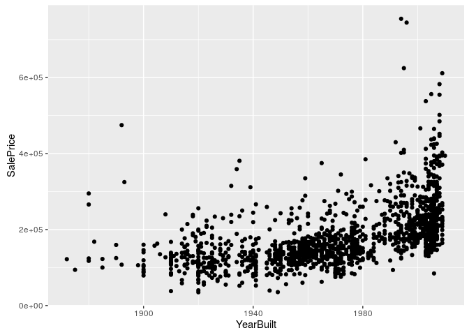
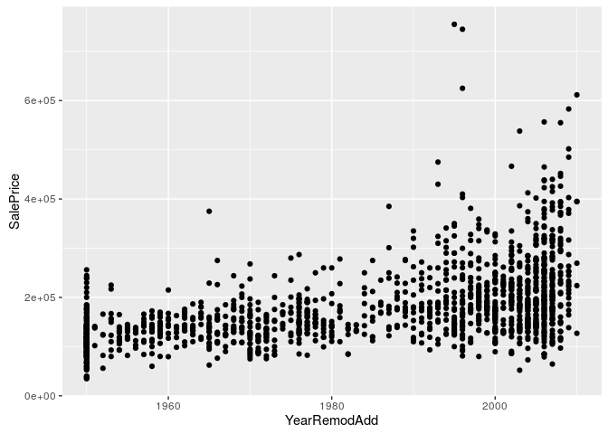
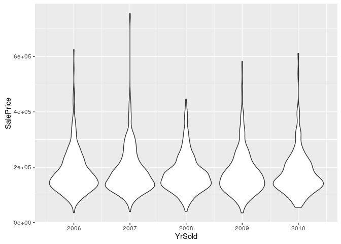
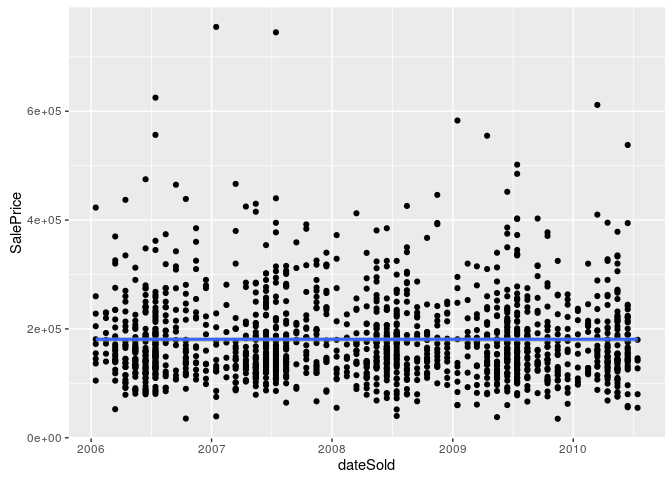
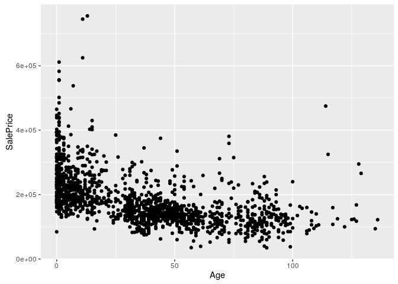
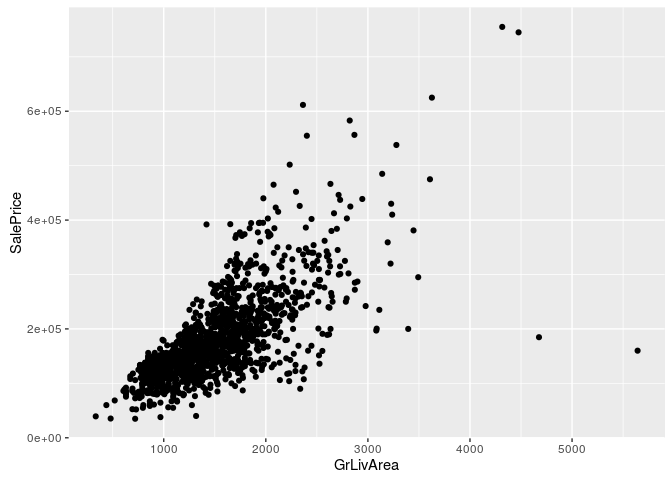
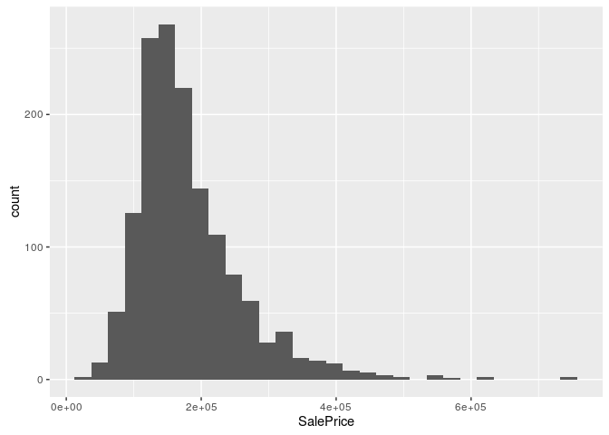

Advanced Regression Techniques for House Pricing
================
Anthony A. Boyles
September 19, 2016

-   [Assemble the Data!](#assemble-the-data)
-   [Clean the Data!](#clean-the-data)
    -   [Bad Names](#bad-names)
    -   [Missing Values](#missing-values)
    -   [Feature Engineering](#feature-engineering)
        -   [Year Built, Remodeled, Sold and Age](#year-built-remodeled-sold-and-age)
        -   [Size](#size)
        -   [Lot Features](#lot-features)
    -   [Outcome Transformation](#outcome-transformation)
    -   [Near-Zero Variance](#near-zero-variance)
    -   [Write the Data!](#write-the-data)
-   [Model the Data!](#model-the-data)
    -   [Linear Model](#linear-model)
    -   [ElasticNet](#elasticnet)
    -   [Cubist](#cubist)
    -   [Random Forest](#random-forest)
    -   [SVM](#svm)
    -   [Gradient Boosting](#gradient-boosting)
    -   [Make Some Predictions!](#make-some-predictions)

Note: while I haven't actually used any code from it, I owe a debt of gratitude to Stephanie Kirmer for [this Kernel](https://www.kaggle.com/skirmer/house-prices-advanced-regression-techniques/fun-with-real-estate-data), which was useful in guiding me through my own early data management and modeling.

``` r
library("readr")
library("plyr")
library("dplyr")
library("intubate")
library("ggplot2")
library("parallel")
library("doMC")
library("caret")
library("MASS")
library("glmnet")
library("glmnetUtils")
library("Cubist")
library("randomForest")
library("e1071")
library("nnet")
library("xgboost")
library("ShRoud")
library("magrittr")
```

Assemble the Data!
==================

``` r
training <- read_csv("rawdata/train.csv")
```

That was uneventful.

Clean the Data!
===============

Bad Names
---------

First things first! Some of these columns have names that start with numerals. That makes R ...itchy. Let's just fix that right quick:

``` r
training %<>%
  dplyr::rename(
    FirstFlrSF  = `1stFlrSF`,
    SecondFlrSF = `2ndFlrSF`,
    ThreeSsnPorch = `3SsnPorch`
  )
```

Note that this won't affect the models in any meaningful way.

Missing Values
--------------

There are a ton of them. They make the models fail. In a perfect world, we would analyze each column for its missingness and do multiple imputation to fill in the values we could reasonably impute, but I don't have the time or the patience for that. Instead, I'm just going to replace all missing values with the arithmetic mean of values in the that column for numeric columns, and "Unknown" for character columns.

``` r
training %<>%
  fixNAs()
```

Feature Engineering
-------------------

Let's just take a look at these, one-by-one. Since there are 79 of them, it may take awhile, so feel free to skip to the end.

### Year Built, Remodeled, Sold and Age

``` r
ggplot(training, aes(YearBuilt, SalePrice)) + geom_point()
```



It looks like just knowing the Year in which the house was built will give us a solid model:

``` r
lm(SalePrice ~ YearBuilt, data=training) %>%
  summary()
```

    ## 
    ## Call:
    ## lm(formula = SalePrice ~ YearBuilt, data = training)
    ## 
    ## Residuals:
    ##     Min      1Q  Median      3Q     Max 
    ## -144191  -40999  -15464   22685  542814 
    ## 
    ## Coefficients:
    ##               Estimate Std. Error t value Pr(>|t|)    
    ## (Intercept) -2.530e+06  1.158e+05  -21.86   <2e-16 ***
    ## YearBuilt    1.375e+03  5.872e+01   23.42   <2e-16 ***
    ## ---
    ## Signif. codes:  0 '***' 0.001 '**' 0.01 '*' 0.05 '.' 0.1 ' ' 1
    ## 
    ## Residual standard error: 67740 on 1458 degrees of freedom
    ## Multiple R-squared:  0.2734, Adjusted R-squared:  0.2729 
    ## F-statistic: 548.7 on 1 and 1458 DF,  p-value: < 2.2e-16

But that graph looks curvilinear to me. Maybe there's a quadratic relationship as well:

``` r
training %>%
  mutate(YearBuilt2 = YearBuilt^2) %>%
  ntbt_lm(SalePrice ~ YearBuilt2 + YearBuilt) %>%
  summary()
```

    ## 
    ## Call:
    ## lm(formula = SalePrice ~ YearBuilt2 + YearBuilt)
    ## 
    ## Residuals:
    ##     Min      1Q  Median      3Q     Max 
    ## -164759  -38552   -9939   20206  542248 
    ## 
    ## Coefficients:
    ##               Estimate Std. Error t value Pr(>|t|)    
    ## (Intercept)  8.191e+07  6.522e+06   12.56   <2e-16 ***
    ## YearBuilt2   2.194e+01  1.694e+00   12.95   <2e-16 ***
    ## YearBuilt   -8.473e+04  6.649e+03  -12.74   <2e-16 ***
    ## ---
    ## Signif. codes:  0 '***' 0.001 '**' 0.01 '*' 0.05 '.' 0.1 ' ' 1
    ## 
    ## Residual standard error: 64170 on 1457 degrees of freedom
    ## Multiple R-squared:  0.3484, Adjusted R-squared:  0.3475 
    ## F-statistic: 389.6 on 2 and 1457 DF,  p-value: < 2.2e-16

Yup. Let's make sure it's in the model!

``` r
training %<>% mutate(YearBuilt2 = YearBuilt^2)
```

How about Remodels?

``` r
ggplot(training, aes(YearRemodAdd, SalePrice)) + geom_point()
```



Again, looks like some sort of curvilinear relationship. Let's look at

``` r
training %>%
  mutate(YearRemodAdd2 = YearRemodAdd*YearRemodAdd) %>%
  ntbt_lm(SalePrice ~ YearRemodAdd + YearRemodAdd2) %>%
  summary()
```

    ## 
    ## Call:
    ## lm(formula = SalePrice ~ YearRemodAdd + YearRemodAdd2)
    ## 
    ## Residuals:
    ##     Min      1Q  Median      3Q     Max 
    ## -166023  -38052   -7232   24060  558408 
    ## 
    ## Coefficients:
    ##                 Estimate Std. Error t value Pr(>|t|)   
    ## (Intercept)    7.008e+07  2.386e+07   2.937  0.00337 **
    ## YearRemodAdd  -7.259e+04  2.411e+04  -3.011  0.00265 **
    ## YearRemodAdd2  1.883e+01  6.089e+00   3.092  0.00203 **
    ## ---
    ## Signif. codes:  0 '***' 0.001 '**' 0.01 '*' 0.05 '.' 0.1 ' ' 1
    ## 
    ## Residual standard error: 68290 on 1457 degrees of freedom
    ## Multiple R-squared:  0.262,  Adjusted R-squared:  0.261 
    ## F-statistic: 258.6 on 2 and 1457 DF,  p-value: < 2.2e-16

Cool, so two more for the pile.

``` r
training %<>% mutate(YearRemodAdd2 = YearRemodAdd*YearRemodAdd)
```

How about the year it was sold?

``` r
ggplot(training, aes(YrSold, SalePrice, group=YrSold)) + geom_violin()
```



Oh, this is fun: the data span the 2008 Housing Crash. Based on these violin plots, it looks like the crash didn't drive a huge decline in prices for mid-level houses, but did cut the long tail of more expensive sales. So, based on this, I wouldn't guess a model could do a ton with the sale year. Let's see:

``` r
lm(SalePrice ~ YrSold, data=training) %>%
  summary()
```

    ## 
    ## Call:
    ## lm(formula = SalePrice ~ YrSold, data = training)
    ## 
    ## Residuals:
    ##     Min      1Q  Median      3Q     Max 
    ## -148752  -50627  -18172   33398  572668 
    ## 
    ## Coefficients:
    ##             Estimate Std. Error t value Pr(>|t|)
    ## (Intercept)  3654560    3144034   1.162    0.245
    ## YrSold         -1730       1566  -1.105    0.269
    ## 
    ## Residual standard error: 79440 on 1458 degrees of freedom
    ## Multiple R-squared:  0.0008365,  Adjusted R-squared:  0.0001512 
    ## F-statistic: 1.221 on 1 and 1458 DF,  p-value: 0.2694

Yup. However, we also know the month in which the house was sold. I doubt the day of the month matters tremendoudly, but the month might.

``` r
training %>%
  mutate(dateSold = as.Date(paste0(YrSold, "/", MoSold, "/15"))) %>%
  ggplot(aes(dateSold, SalePrice)) + geom_point() + geom_smooth()
```



But there may still be a way we can mine some useful information from this data. There's a funny little thing we don't know, but we *can* infer: the age of a house.

``` r
training %>%
  mutate(Age = YrSold - YearBuilt) %>%
  ggplot(aes(Age, SalePrice)) +
  geom_point()
```



``` r
training %>%
  mutate(
    Age = YrSold - YearBuilt,
    OneAge = 1 / (1+Age),
    AgeRemod = YrSold - YearRemodAdd
  ) %>%
  ntbt_lm(SalePrice ~ Age + OneAge + AgeRemod + YearBuilt + YearBuilt2 + YearRemodAdd + YearRemodAdd2) %>%
  summary()
```

    ## 
    ## Call:
    ## lm(formula = SalePrice ~ Age + OneAge + AgeRemod + YearBuilt + 
    ##     YearBuilt2 + YearRemodAdd + YearRemodAdd2)
    ## 
    ## Residuals:
    ##     Min      1Q  Median      3Q     Max 
    ## -180335  -37687   -9623   21895  544563 
    ## 
    ## Coefficients: (1 not defined because of singularities)
    ##                 Estimate Std. Error t value Pr(>|t|)    
    ## (Intercept)    5.627e+07  2.618e+07   2.149   0.0318 *  
    ## Age           -4.147e+03  2.676e+04  -0.155   0.8769    
    ## OneAge         2.200e+04  1.129e+04   1.948   0.0516 .  
    ## AgeRemod       3.095e+03  2.658e+04   0.116   0.9073    
    ## YearBuilt     -5.779e+04  2.623e+04  -2.203   0.0278 *  
    ## YearBuilt2     1.392e+01  2.207e+00   6.308 3.74e-10 ***
    ## YearRemodAdd          NA         NA      NA       NA    
    ## YearRemodAdd2  9.626e-01  6.718e+00   0.143   0.8861    
    ## ---
    ## Signif. codes:  0 '***' 0.001 '**' 0.01 '*' 0.05 '.' 0.1 ' ' 1
    ## 
    ## Residual standard error: 63290 on 1453 degrees of freedom
    ## Multiple R-squared:  0.368,  Adjusted R-squared:  0.3654 
    ## F-statistic:   141 on 6 and 1453 DF,  p-value: < 2.2e-16

It seems there's more signal in the absolute year in which the house was built than there is in the actual age of the house. This may be a byproduct of the fact that the sales data comes from a comparatively narrow time window of about four years. Oh, and remodels fall out entirely. Never-the-less, it seems that the inverse-age of the house still carries some notable information.

``` r
training %<>% mutate(OneAge = 1/(1+YrSold-YearBuilt))
```

### Size

It matters, people.

``` r
ggplot(training, aes(GrLivArea, SalePrice)) + geom_point()
```



Linear out of the box! Niiiiice.

``` r
training %>%
  mutate(
    logGrLivArea = log(GrLivArea),
    sqrtGrLivArea = sqrt(GrLivArea),
    GrLivArea2 = GrLivArea^2,
    GrLivArea3 = GrLivArea^3
  ) %>%
  ntbt_lm(SalePrice ~ logGrLivArea + sqrtGrLivArea + GrLivArea + GrLivArea2 + GrLivArea3) %>%
  summary()
```

    ## 
    ## Call:
    ## lm(formula = SalePrice ~ logGrLivArea + sqrtGrLivArea + GrLivArea + 
    ##     GrLivArea2 + GrLivArea3)
    ## 
    ## Residuals:
    ##     Min      1Q  Median      3Q     Max 
    ## -277149  -29643    -740   22309  335142 
    ## 
    ## Coefficients:
    ##                 Estimate Std. Error t value Pr(>|t|)    
    ## (Intercept)    7.423e+06  3.287e+06   2.258 0.024073 *  
    ## logGrLivArea  -2.255e+06  9.329e+05  -2.417 0.015772 *  
    ## sqrtGrLivArea  4.035e+05  1.494e+05   2.702 0.006981 ** 
    ## GrLivArea     -5.002e+03  1.705e+03  -2.934 0.003402 ** 
    ## GrLivArea2     5.628e-01  1.543e-01   3.647 0.000275 ***
    ## GrLivArea3    -4.320e-05  9.837e-06  -4.391 1.21e-05 ***
    ## ---
    ## Signif. codes:  0 '***' 0.001 '**' 0.01 '*' 0.05 '.' 0.1 ' ' 1
    ## 
    ## Residual standard error: 54780 on 1454 degrees of freedom
    ## Multiple R-squared:  0.5261, Adjusted R-squared:  0.5245 
    ## F-statistic: 322.8 on 5 and 1454 DF,  p-value: < 2.2e-16

Now, I tortured this until it started giving me any less than three stars, so there's a *lot* to be said for square footage. Into the model it goes!

``` r
training %>%
  mutate(
    logGrLivArea = log(GrLivArea),
    sqrtGrLivArea = sqrt(GrLivArea),
    GrLivArea2 = GrLivArea^2,
    GrLivArea3 = GrLivArea^3
  )
```

    ## # A tibble: 1,460 × 88
    ##       Id MSSubClass MSZoning LotFrontage LotArea Street   Alley LotShape
    ##    <int>      <int>    <chr>       <int>   <int>  <chr>   <chr>    <chr>
    ## 1      1         60       RL          65    8450   Pave Unknown      Reg
    ## 2      2         20       RL          80    9600   Pave Unknown      Reg
    ## 3      3         60       RL          68   11250   Pave Unknown      IR1
    ## 4      4         70       RL          60    9550   Pave Unknown      IR1
    ## 5      5         60       RL          84   14260   Pave Unknown      IR1
    ## 6      6         50       RL          85   14115   Pave Unknown      IR1
    ## 7      7         20       RL          75   10084   Pave Unknown      Reg
    ## 8      8         60       RL          70   10382   Pave Unknown      IR1
    ## 9      9         50       RM          51    6120   Pave Unknown      Reg
    ## 10    10        190       RL          50    7420   Pave Unknown      Reg
    ## # ... with 1,450 more rows, and 80 more variables: LandContour <chr>,
    ## #   Utilities <chr>, LotConfig <chr>, LandSlope <chr>, Neighborhood <chr>,
    ## #   Condition1 <chr>, Condition2 <chr>, BldgType <chr>, HouseStyle <chr>,
    ## #   OverallQual <int>, OverallCond <int>, YearBuilt <int>,
    ## #   YearRemodAdd <int>, RoofStyle <chr>, RoofMatl <chr>,
    ## #   Exterior1st <chr>, Exterior2nd <chr>, MasVnrType <chr>,
    ## #   MasVnrArea <int>, ExterQual <chr>, ExterCond <chr>, Foundation <chr>,
    ## #   BsmtQual <chr>, BsmtCond <chr>, BsmtExposure <chr>,
    ## #   BsmtFinType1 <chr>, BsmtFinSF1 <int>, BsmtFinType2 <chr>,
    ## #   BsmtFinSF2 <int>, BsmtUnfSF <int>, TotalBsmtSF <int>, Heating <chr>,
    ## #   HeatingQC <chr>, CentralAir <chr>, Electrical <chr>, FirstFlrSF <int>,
    ## #   SecondFlrSF <int>, LowQualFinSF <int>, GrLivArea <int>,
    ## #   BsmtFullBath <int>, BsmtHalfBath <int>, FullBath <int>,
    ## #   HalfBath <int>, BedroomAbvGr <int>, KitchenAbvGr <int>,
    ## #   KitchenQual <chr>, TotRmsAbvGrd <int>, Functional <chr>,
    ## #   Fireplaces <int>, FireplaceQu <chr>, GarageType <chr>,
    ## #   GarageYrBlt <int>, GarageFinish <chr>, GarageCars <int>,
    ## #   GarageArea <int>, GarageQual <chr>, GarageCond <chr>,
    ## #   PavedDrive <chr>, WoodDeckSF <int>, OpenPorchSF <int>,
    ## #   EnclosedPorch <int>, ThreeSsnPorch <int>, ScreenPorch <int>,
    ## #   PoolArea <int>, PoolQC <chr>, Fence <chr>, MiscFeature <chr>,
    ## #   MiscVal <int>, MoSold <int>, YrSold <int>, SaleType <chr>,
    ## #   SaleCondition <chr>, SalePrice <int>, YearBuilt2 <dbl>,
    ## #   YearRemodAdd2 <int>, OneAge <dbl>, logGrLivArea <dbl>,
    ## #   sqrtGrLivArea <dbl>, GrLivArea2 <dbl>, GrLivArea3 <dbl>

### Lot Features

``` r
training %<>%
  mutate(
    Baths = FullBath + HalfBath,
    BsmtBaths = BsmtFullBath + BsmtHalfBath,
    OverallQualSquare = OverallQual*OverallQual,
    OverallQualCube = OverallQual*OverallQual*OverallQual,
    OverallQualExp = expm1(OverallQual),
    TotalBsmtSFGrLivArea = TotalBsmtSF/GrLivArea,
    OverallCondSqrt = sqrt(OverallCond),
    OverallCondSquare = OverallCond*OverallCond,
    LotAreaSqrt = sqrt(LotArea),
    FirstFlrSFSqrt = sqrt(FirstFlrSF),
    TotRmsAbvGrdSqrt = sqrt(TotRmsAbvGrd)
  )
```

Outcome Transformation
----------------------

If we take a look at the distribution of our outcome metric...

``` r
training %>%
  ggplot(aes(SalePrice)) +
  geom_histogram()
```

    ## `stat_bin()` using `bins = 30`. Pick better value with `binwidth`.



You'll note that these values vary over several orders of magnitude (as [Alexandru Papieu pointed out](https://www.kaggle.com/apapiu/house-prices-advanced-regression-techniques/regularized-linear-models)), so it may make more sense to predict the log-transformation of the data.

``` r
training %>%
  mutate(SalePrice = log1p(SalePrice)) %>%
  ggplot(aes(SalePrice)) +
  geom_histogram()
```

    ## `stat_bin()` using `bins = 30`. Pick better value with `binwidth`.


It certainly apprears to be closer to normally-distributed (which is helpful). What about the predictors? Well, let's take a look at some correlations:

Note: I'll start cross-validating once I'm building models for prediction. These are just to give us a feel for whether or not a particular treatment (in this case, log-transformation) helps us.

``` r
training %>%
  ntbt_lm(SalePrice ~ .) %>%
  summary() %>%
  use_series(r.squared)
```

    ## [1] 0.9391548

``` r
training %>%
  mutate(SalePrice = log1p(SalePrice)) %>%
  ntbt_lm(SalePrice ~ .) %>%
  summary() %>%
  use_series(r.squared)
```

    ## [1] 0.9478421

So we get a tiny boost from log-transforming the outcome. Let's keep it.

``` r
training <- mutate(training, SalePrice = log1p(SalePrice))
```

Near-Zero Variance
------------------

The biggest problem I encountered in early modeling efforts was factors with values that occur infrequently in the data. Basically, what happens is we partition the data for cross-validation and there's a factor with one (or a few) especially rare value. All instances of that rare value land in the test data, so we have no way to assign a coefficient to it, and the model fails.

The simplest way to handle this is to drop any categorical variable with a value that is rarer than some tolerance threshold for model failure (basically, how patient you are). That's what I did for my first pass:

``` r
# Note that this code is not run:
training %<>% dplyr::select(-c(MSZoning, Street, Alley, LotShape, Utilities, LandSlope, Neighborhood, Condition1, Condition2, HouseStyle, RoofStyle, RoofMatl, Exterior1st, Exterior2nd, MasVnrType, ExterQual, ExterCond, Foundation, BsmtCond, BsmtFinType2, Heating, HeatingQC, Electrical, Functional, GarageType, GarageQual, GarageCond, PoolQC, Fence, MiscFeature, SaleType, SaleCondition, LotConfig))
```

A better way to solve this problem is to translate ordinal variables onto a continuous scale. A computer can't figure out how far "good" is from "poor," but it can definitely figure out the difference between 4 and 1. That works adequately for ordinal variables, but its throwing away some discernable signal, and it works less well for nominal variables. For example, there is no inherent ordinality in countertop materials, but the market values granite more highly than formica. This is particularly instructive: instead of assuming that an ordinal variable follows its order, let's actually take the mean price for each category and see whether it follows the implied ordering.

So, let's take a category we'd otherwise throw away, and figure out how to numberify it.

``` r
table(training$ExterCond)
```

    ## 
    ##   Ex   Fa   Gd   Po   TA 
    ##    3   28  146    1 1282

Perfect. With a 70-30 training-test partitioning, the probability that Po ("Poor") has no representatives in the training data is .3, which is totally unworkable. (The generalized formula for that metric, by the way, is *P*(Model Failure)=(1 − Training Proportion)<sup>size\\ of\\ smallest\\ category</sup>.) To fix it, let's look at the mean house price for each member of the class:

``` r
training %>%
  group_by(ExterCond) %>%
  summarise(AveragePrice = mean(SalePrice))
```

    ## # A tibble: 5 × 2
    ##   ExterCond AveragePrice
    ##       <chr>        <dbl>
    ## 1        Ex     12.11973
    ## 2        Fa     11.45517
    ## 3        Gd     11.96946
    ## 4        Po     11.24506
    ## 5        TA     12.04308

Here we can see that houses in Typical/Average shape on their exteriors actually fetch a slightly higher price, on average, than houses rated as being in "Good" shape. Cool! So, for every categorical variable that has a sufficiently high probability of causing a modeling failure, let's replace the categories with their average SalePrice.

``` r
failureThreshold <- 1e-6

transformedCategories <- list()

for(column in colnames(training)){
  if(is.character(training[[column]])){
    # This is not a sane way to do this, but I don't know any better way.
    temp <- eval(parse(text = paste0("group_by(training, ", column, ")"))) %>%
      summarise(AveragePrice = mean(SalePrice))
    replacements <- as.list(temp$AveragePrice)
    names(replacements) <- temp[[column]]
    training <- eval(parse(text = paste0("mutate(training, ", column," = as.numeric(replacements[", column,"]))")))
    transformedCategories[[column]] <- replacements
  }
}
```

OK, that's fun, but did it help us?

``` r
training %>%
  ntbt_lm(SalePrice ~ .) %>%
  summary() %>%
  use_series(r.squared)
```

    ## [1] 0.9180502

Sadly, not, though it doesn't seem to hurt us much. More importantly, it resolves some modelling problems down the road, so Let's keep it anyway.

Write the Data!
---------------

Training is all set to go! Now we just need to give test the same treatment...

``` r
preparedtraining <- training

preparedtest <- read_csv("rawdata/test.csv") %>%
  dplyr::rename(
    FirstFlrSF  = `1stFlrSF`,
    SecondFlrSF = `2ndFlrSF`,
    ThreeSsnPorch = `3SsnPorch`
  ) %>%
  fixNAs() %>%
  mutate(
    YearBuilt2 = YearBuilt^2,
    YearRemodAdd2 = YearRemodAdd*YearRemodAdd,
    logGrLivArea = log(GrLivArea),
    sqrtGrLivArea = sqrt(GrLivArea),
    GrLivArea2 = GrLivArea^2,
    GrLivArea3 = GrLivArea^3,
    OneAge = 1/(1+YrSold - YearBuilt),
    Baths = FullBath + HalfBath,
    BsmtBaths = BsmtFullBath + BsmtHalfBath,
    OverallQualSquare = OverallQual*OverallQual,
    OverallQualCube = OverallQual*OverallQual*OverallQual,
    OverallQualExp = expm1(OverallQual),
    GrLivAreaLog = log(GrLivArea),
    TotalBsmtSFGrLivArea = TotalBsmtSF/GrLivArea,
    OverallCondSqrt = sqrt(OverallCond),
    OverallCondSquare = OverallCond*OverallCond,
    LotAreaSqrt = sqrt(LotArea),
    FirstFlrSFSqrt = sqrt(FirstFlrSF),
    TotRmsAbvGrdSqrt = sqrt(TotRmsAbvGrd)
  )

for(column in names(transformedCategories)){
  replacements <- transformedCategories[[column]]
  preparedtest <- eval(parse(text = paste0("mutate(preparedtest, ", column, " = replacements[preparedtest$", column, "][[1]])")))
}
```

And, we're done! On to...

Model the Data!
===============

Now, to make a preliminary preparation, let's partition the data into training and test sets so we can do some of our own scoring without having to submit new entries to Kaggle all the time.

``` r
temp <- training %>% mutate(train = runif(n()) < .7)
train <- temp %>% filter( train) %>% dplyr::select(-train)
test  <- temp %>% filter(!train) %>% dplyr::select(-train)
```

Also, I'm going to use Caret to fit the hyperparameters on models where that's useful, so I'm going to need a training controller for cross-validation.

``` r
fitControl <- trainControl(method = "repeatedcv", number = 5, repeats = 5)
registerDoMC(cores = detectCores() - 1)
```

Linear Model
------------

``` r
#modelLM <- lm(SalePrice ~ ., data=train)
modelLM <- train %>%
  ntbt_train(SalePrice ~ ., method = "lm", trControl = fitControl)
  
summary(modelLM)$r.squared
```

    ## [1] 0.9204404

Not bad for a first stab, but how well does it actually score?

``` r
modelLM %>%
  predict(test) %>%
  rmse(test$SalePrice)
```

    ## [1] 0.1286656

OK, so that's our first quality benchmark.

ElasticNet
----------

I thought about doing Ridge Regression or LASSO, but why do either when you can do both at once?

``` r
train %>%
  ntbt_train(SalePrice ~ ., method = "glmnet", trControl = fitControl) %>%
  predict(test) %>%
  rmse(test$SalePrice)
```

    ## [1] 0.1279219

Cubist
------

This one will burn through a few cycles, caveat emptor.

``` r
train %>%
  ntbt_train(SalePrice ~ ., method = "cubist", trControl = fitControl) %>%
  predict(test) %>%
  rmse(test$SalePrice)
```

    ## [1] 0.121057

Random Forest
-------------

This one will burn through a few cycles, caveat emptor.

``` r
train %>%
  factorize() %>%
  ntbt_train(SalePrice ~ ., method = "rf", trControl = fitControl) %>%
  predict(test) %>%
  rmse(test$SalePrice)
```

    ## [1] 0.1420911

SVM
---

I actually started using Caret specifically to fit hyperparameters on SVMs.

``` r
train %>%
  ntbt_train(SalePrice ~ ., method = "svmLinear2", trControl = fitControl) %>%
  predict(test) %>%
  rmse(test$SalePrice)
```

Gradient Boosting
-----------------

``` r
train %>%
  ntbt_train(SalePrice ~ ., method = "gbm", trControl = fitControl, verbose = FALSE) %>%
  predict(test) %>%
  rmse(test$SalePrice)
```

    ## Loading required package: gbm

    ## Loading required package: survival

    ## 
    ## Attaching package: 'survival'

    ## The following object is masked from 'package:caret':
    ## 
    ##     cluster

    ## Loading required package: splines

    ## Loaded gbm 2.1.1

    ## [1] 0.1267019

Make Some Predictions!
----------------------

Let's rerun it on the entire Kaggle training set, predict on the test set, write and submit it.

``` r
LM <- predict(train(SalePrice ~ ., data = preparedtraining, method = "lm", trControl = fitControl), preparedtest)
```

    ## Warning in predict.lm(modelFit, newdata): prediction from a rank-deficient
    ## fit may be misleading

``` r
EN <- predict(train(SalePrice ~ ., data = preparedtraining, method = "glmnet", trControl = fitControl), preparedtest)
C  <- predict(train(SalePrice ~ ., data = preparedtraining, method = "cubist", trControl = fitControl), preparedtest)
#RF <- predict(train(SalePrice ~ ., data = factorize(preparedtraining), method = "rf", trControl = fitControl), factorize(preparedtest))
GBM <- predict(train(SalePrice ~ ., data = preparedtraining, method = "gbm", trControl = fitControl), preparedtest)
```

    ## Iter   TrainDeviance   ValidDeviance   StepSize   Improve
    ##      1        0.1416            -nan     0.1000    0.0190
    ##      2        0.1259            -nan     0.1000    0.0151
    ##      3        0.1126            -nan     0.1000    0.0129
    ##      4        0.1014            -nan     0.1000    0.0107
    ##      5        0.0910            -nan     0.1000    0.0104
    ##      6        0.0826            -nan     0.1000    0.0080
    ##      7        0.0758            -nan     0.1000    0.0068
    ##      8        0.0697            -nan     0.1000    0.0055
    ##      9        0.0637            -nan     0.1000    0.0050
    ##     10        0.0589            -nan     0.1000    0.0050
    ##     20        0.0311            -nan     0.1000    0.0013
    ##     40        0.0174            -nan     0.1000    0.0002
    ##     60        0.0141            -nan     0.1000    0.0001
    ##     80        0.0125            -nan     0.1000   -0.0000
    ##    100        0.0115            -nan     0.1000    0.0000
    ##    120        0.0108            -nan     0.1000   -0.0000
    ##    140        0.0101            -nan     0.1000   -0.0000
    ##    150        0.0099            -nan     0.1000   -0.0000

``` r
cbind(
  preparedtest,
  LM, EN, C, GBM
  ) %>%
  mutate(SalePrice = expm1((LM + EN + C + GBM) / 4)) %>%
  dplyr::select(Id, SalePrice) %>%
  write_csv("predictions/predictionMean.csv")
```
